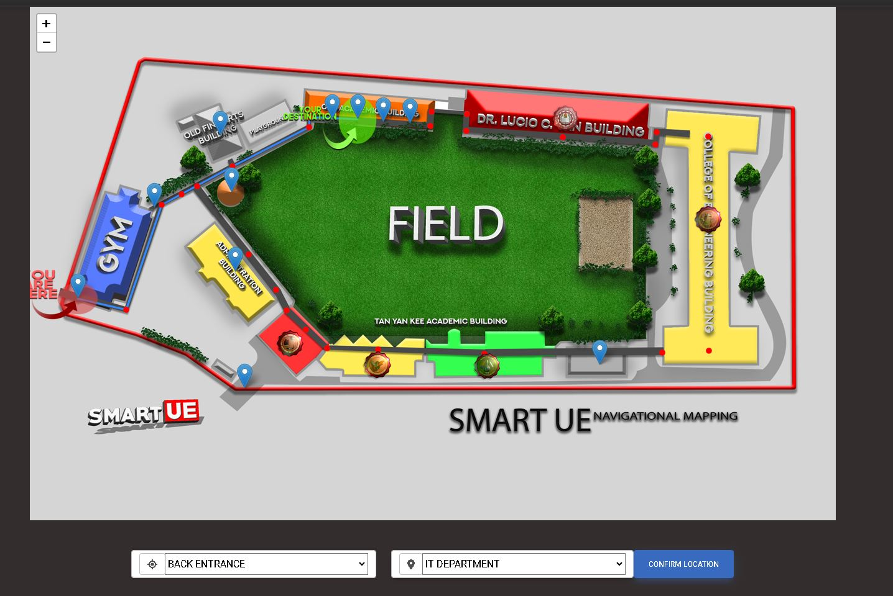
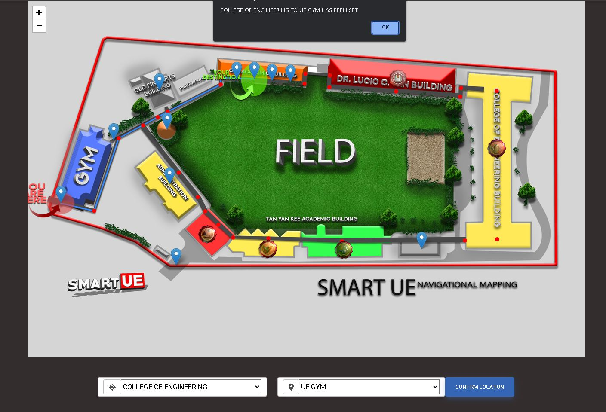

# University of the East Navigational Mapping


## Overview

Welcome to the University of the East Navigational Mapping project! This repository is dedicated to providing a comprehensive mapping solution for the University of the East, helping students, faculty, and visitors find their way around the campus with ease.

## Features

- **Interactive Maps:** Detailed and interactive maps of the University of the East campus, highlighting important locations such as classrooms, offices, and facilities.

- **Mobile-Friendly:** Our mapping solution is designed to work seamlessly on both desktop and mobile devices, ensuring accessibility for all users.

## Getting Started

To use the University of the East Navigational Mapping system, follow these steps:

1. **Clone the Repository:** Begin by cloning this repository to your local machine using Git:

   ```bash
   git clone https://github.com/Mark2UE/ue_map.git
Open the Mapping Application: Once the repository is cloned, navigate to the project directory and open the mapping application in your web browser.

Explore the Campus: Start exploring the University of the East campus by interacting with the maps and using the search functionality.

## DEVELOPERS | THESISMATES
MARK MANLICLIC (MAIN)<br>
ALKIAN RAE CHALUANGCO<br>
VINCE ERFE <br>
JAY MARK CORDOVA<br>
RICHMOND LAGMAN <br>
Issues
If you encounter any issues, bugs, or have suggestions for improvement, please open an issue on our GitHub repository. We appreciate your feedback!


## Sample UI



